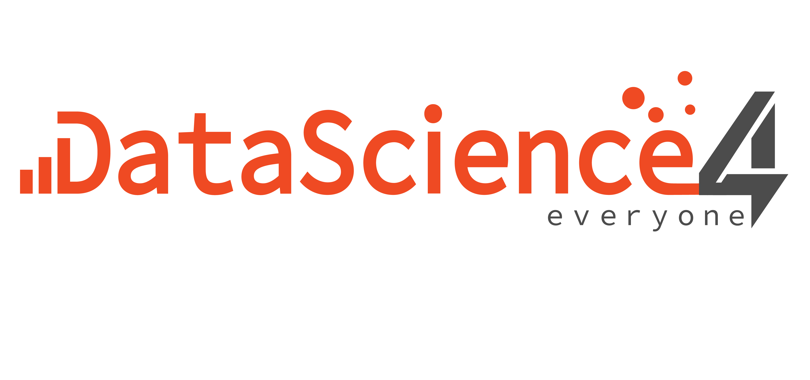

::::::: columns
:::: {.column width="50%"}
::: {style="text-align: left;"}
{width="68%" fig-cap="" align="left"}
:::
::::

:::: {.column width="50%"}
::: {style="text-align: left;"}
{height="120px" fig-cap=""}
:::
::::
:::::::

::::::: columns
:::: {.column width="50%"}
::: {style="text-align: left;"}
{height="70px" fig-cap=""}
:::
::::

:::: {.column width="50%"}
::: {style="text-align: left;"}
{height="30px" fig-cap="" style="margin-top: 22px;"}
:::
::::
:::::::

This resource is intended for high school statistics teachers seeking to extend student learning beyond AP Statistics course. It provides a teacher-facing guide for the After the AP Data Science Challenge.

The materials for the challenge are designed for students who have completed AP Statistics.
