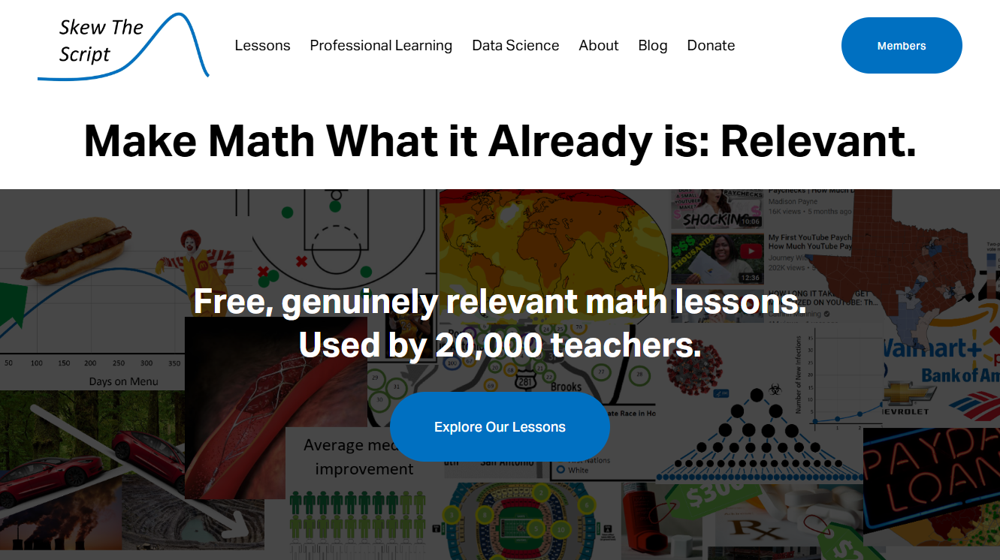
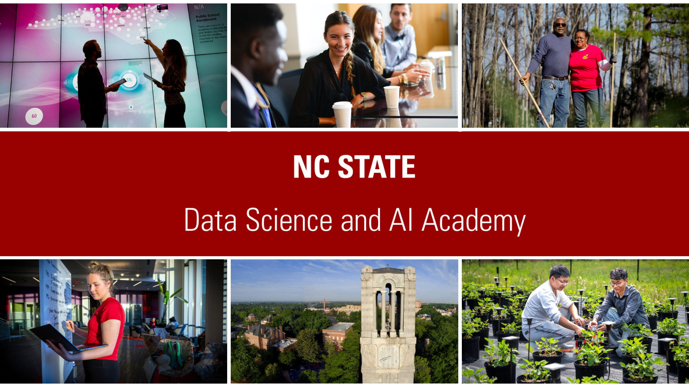

## Skew the Script

**What we do:** [Skew The Script](https://skewthescript.org/) is a nonprofit that provides free, genuinely relevant math lessons to more than 20,000 teachers nationwide. The organization provides open-source lessons that infuse genuinely relevant contexts and datasets into Algebra 1, Algebra 2, and AP Statistics.

**Our role in the data science challenge:** Seeing a demand from AP Statistics teachers to show their students more modern data science skills - beyond the scope of AP Statistics - Skew The Script authored the original data science challenge notebooks. With tremendous support and partnership from Data Science 4 Everyone, CourseKata, and NC State Data Science & AI Academy, Skew The Script led the challenge during its initial years. Skew The Script continues to support the dissemination of the challenge among its network of AP Statistics teachers.

## CourseKata

## The North Carolina State Data Science and AI Academy

The NC State Data Science and AI Academy (DSA) supported the *After the AP Data Science Challenge* by conducting the [Survey Response Analysis](reports/survey-response-analysis.pdf), which gathered and analyzed educator feedback following the pilot implementation. The analysis, prepared by Taryn Shelton, DSA K–12 Programs Coordinator, helped inform revisions to the challenge and strengthen its alignment with classroom needs. This work reflects DSA’s broader commitment to advancing data science and AI literacy across K–12 education in North Carolina and beyond.